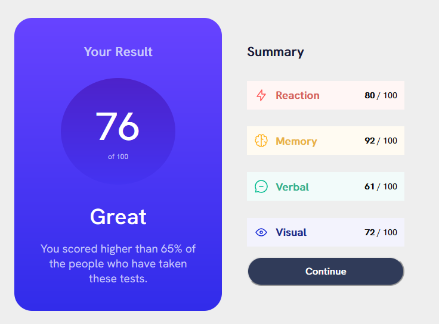

# Frontend Mentor - Results summary component solution

This is a solution to the [Results summary component challenge on Frontend Mentor](https://www.frontendmentor.io/challenges/results-summary-component-CE_K6s0maV). Frontend Mentor challenges help you improve your coding skills by building realistic projects.

## Table of contents

- [Frontend Mentor - Results summary component solution](#frontend-mentor---results-summary-component-solution)
  - [Table of contents](#table-of-contents)
  - [Overview](#overview)
    - [The challenge](#the-challenge)
    - [Screenshot](#screenshot)
    - [Links](#links)
  - [My process](#my-process)
    - [Built with](#built-with)
    - [What I learned](#what-i-learned)
    - [Useful resources](#useful-resources)

## Overview

### The challenge

Users should be able to:

- View the optimal layout for the interface depending on their device's screen size
- See hover and focus states for all interactive elements on the page

### Screenshot



### Links

- Live Site URL: [Github Pages](https://your-live-site-url.com)

## My process

### Built with

- HTML5 markup
- CSS custom properties
- Flexbox
- CSS Grid
- Desktop-first workflow
- [Astro](https://astro.build/) - All-in-one framework

### What I learned

I've learned all the basics of Astro, including the Islands Architecture, Astro Components (with a JSX-like syntax) and the basics of the Astro Router.

On Astro's Islands Architecture i've learned about the concept of "Islands", which are basically the same as "Components" in React. The difference is that in Astro, you can use HTML, CSS and JS in the same file, and you can use the same syntax as JSX, but with HTML tags instead of React Components.

Also, Astro's treatment for JS is very special, you have a node-like backend app at the top of each .astro file that you can use to fetch data even from a sensitive database. All of the JS code that you write here will not be shiped on your frontend, it will be executed on the "server" and the result will be shiped to the client. This is very useful for SEO.

You can also add client interactivity using old \<script\> tags. By using astro, you avoid interacting directly with other bundling tools such as Vite or Webpack.

Here is an example of a simple Astro Component that shows the described concepts:

```html
---
import CategoryResult from "./CategoryResult.astro";
import ContinueButton from "./ContinueButton.astro";
const { stats } = Astro.props;
---

<style>
	.summary {
		width: 29rem;
		height: 41rem;
		display: flex;
		flex-direction: column;
		align-items: center;
		padding: 3.5rem;
		justify-content: space-between;
	}

	.summary-title {
		font-size: 1.8rem;
		color: #1a1a36;
		align-self: start;
		font-weight: 600;
		margin-bottom: 1.5rem;
	}

	@media only screen and (max-width: 600px) {
		.summary {
			width: 100%;
            flex-grow: 1;
		}
	}
</style>

<div class="summary">
	<h2 class="summary-title">Summary</h2>
	{
		stats.map((stat, i) => {
			const classNames = {
				0: "category-result u-red",
				1: "category-result u-yellow",
				2: "category-result u-green",
				3: "category-result u-blue",
			};

			return (
				<CategoryResult
					score={stat.score}
					icon={stat.icon}
					name={stat.category}
					className={classNames[i]}
				/>
			);
		})
	}
	<ContinueButton />
</div>

```

### Useful resources

- [Astro docs](https://docs.astro.build/en/getting-started/) - The official documentation of Astro is very complete and easy to understand. The best resource if you're looking to learn Astro by far.
